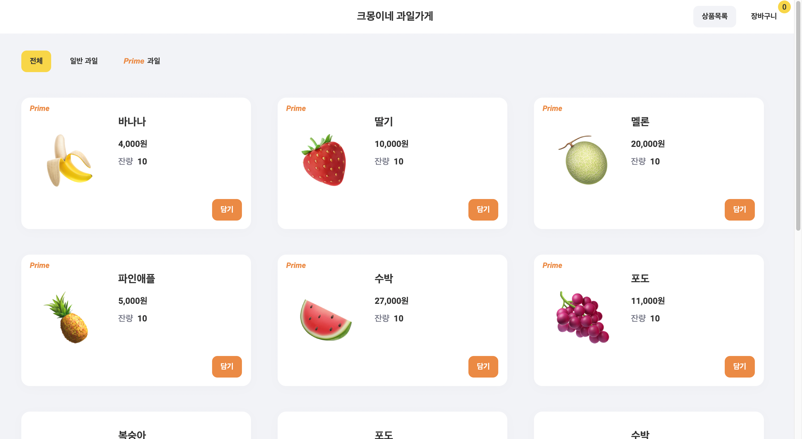
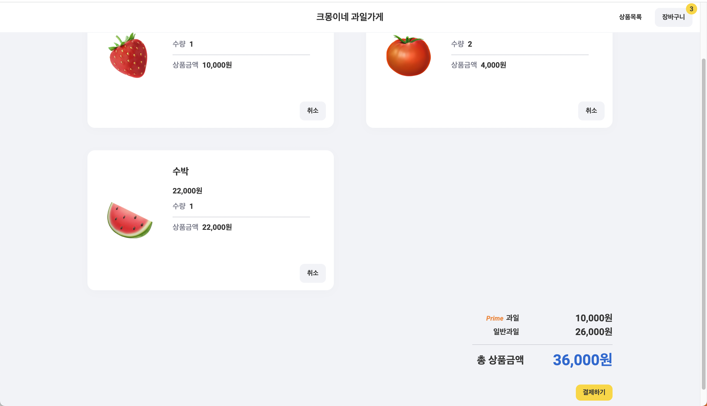

# 크몽 front-end 사전 과제

## 과제 참고 내용
- 기간: 5.12(목) 18:00 ~ 5.14(토) 18:00 (48시간)

## 세팅

- Language & Library: Typescript, React
- 전역상태 관리: Context API
- 스타일링: Styled-component
- Etc: Eslint, Prettier 등등

## 데이터
Mock data (./src/data/fruits.json) 파일을 생성하여, json-server을 실행하여, 임의의 api 서버를 열어주었습니다.

---

## 실행 방법

- node_modules 설치를 위해 다음과 같이 터미널에 입력해주세요.
```js
npm install
```

- 설치가 완료 되었다면, 임의의 mock api를 띄우기 위해 다음과 같이 터미널에 입력해주세요.

```js
npm run mockServer
```

- api는 localhost port:4000으로 실행 되며, fruits 에 대한 api의 주소는 `http://localhost:4000/fruits` 입니다.

- node_modules와, mock server를 실행 시켰다면, 터미널에 `npm start` 를 입력하여, 프로젝트를 실행해주세요.

---

## 프로젝트 관련 이미지

- 메인 (http://localhost:3000)



- 장바구니 (http://localhost:3000/cart)



---

## 추가 설명

- 전역 상태관리는, 규모가 크지 않아 따로 redux나 mobx, recoil 등의 전역 라이브러리를 설치하지 않고 Context API를 사용하여 전역 상태 관리를 하였습니다.

- api는 임의로 mock 데이터를 생성하여, axios.get을 통하여, 데이터를 불러 옵니다.

- 또한, mock api의 한계로 인하여, 필터 (전체, 일반과일, prime 과일)을 선택 했을 때, 해당 필터에 맞게 api를 요청 할 수 없어, 전체 list를 불러 온 후, 필터에 맞게 가공하였습니다.
